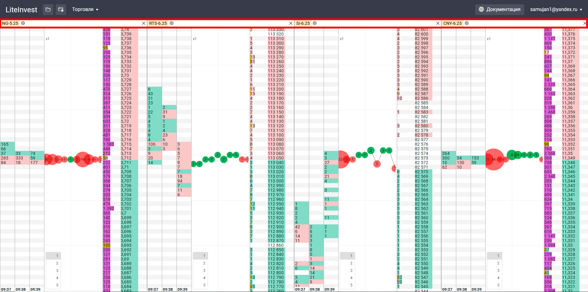
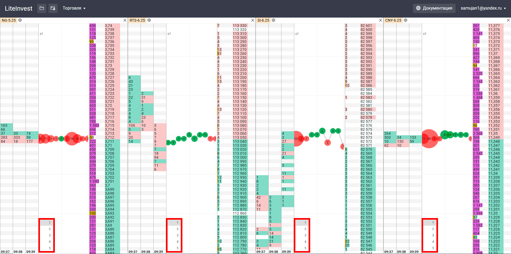

# Описание интерфейса терминала Cassandra

В интерфейсе терминала Cassandra есть все необходимые элементы для полноценной торговли. Разберем каждую область терминала отдельно.

## 1. Основное меню программы:

### 1.1 Поиск по инструментам

### 1.2 Меню «Торговля» – содержит в себе пункты:
- **Активные ордера**: вызов окна активных заказов.
- **Активные позиции**: вызов окна активных позиций.
- **Финрез**: вызов окна финансового результата.

#### 1.1.1 Пункт «Активные ордера»
- Открывает окно активных заказов.

#### 1.1.2 Пункт «Активные позиции»
- Открывает окно активных позиций.

#### 1.1.3 Пункт «Финрез»
- Открывает окно финансового результата.

## 2. Отображение текущих стаканов:
- Здесь отображаются текущие стаканы.
- Можно добавить, переместить или удалить стакан.

## 3. Название выбранного торгового инструмента:
- Показывает название текущего выбранного инструмента.

## 4. Значок «Настройки»:
- Для вызова окна настроек инструмента.

## 5. Индикатор масштаба стакана:
- Указывает на увеличение масштаба цены.

## 6. Прошедшие сделки (тики):
- Отображает информацию о прошедших сделках.

## 7. Стакан:
- Список заявок на покупку и продажу.

## 8. Таблица кластеров
- Показывает объем прошедших сделок.

## 9. Рабочий объем
- Для быстрого выбора рабочего объема
- Рабочий объем можно настраивать двойным кликом на значение рабочего объема, либо через [меню настроек инструмента](#_4-Значок-«Настройки»).

