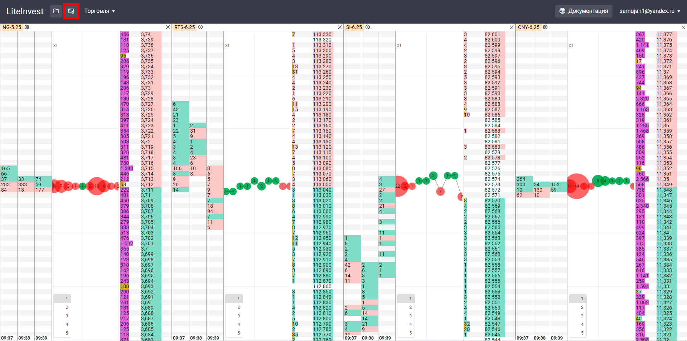

# Описание функции «Рабочие пространства»

Функция **«Рабочие пространства»** позволяет пользователю работать одновременно в нескольких окнах терминала Cassandra. Это удобно при торговле несколькими инструментами или при разделении задач по отдельным экранам.

## 1. Добавление рабочего пространства

- Для создания нового рабочего пространства нажмите кнопку **«+ Рабочее пространство»**.
- Откроется новое окно браузера с дополнительным экземпляром интерфейса терминала.
- Количество рабочих пространств **не ограничено** — пользователь может открывать столько окон, сколько необходимо.

## 2. Сохранение и восстановление

- Все активные рабочие пространства **автоматически сохраняются** при выходе из терминала.
- При следующем входе пользователю отображается **список ранее открытых пространств** — каждое можно открыть повторно одним кликом.

- Если закрыто **только основное окно (мастер-пространство)**, все остальные рабочие пространства сохраняются и доступны после повторного входа.

## 3. Удаление рабочего пространства

- Если пользователь **вручную закрывает окно с рабочим пространством**, оно считается **ненужным** и **удаляется из базы**.
- Такое пространство **не будет отображено в списке** при следующем входе.
